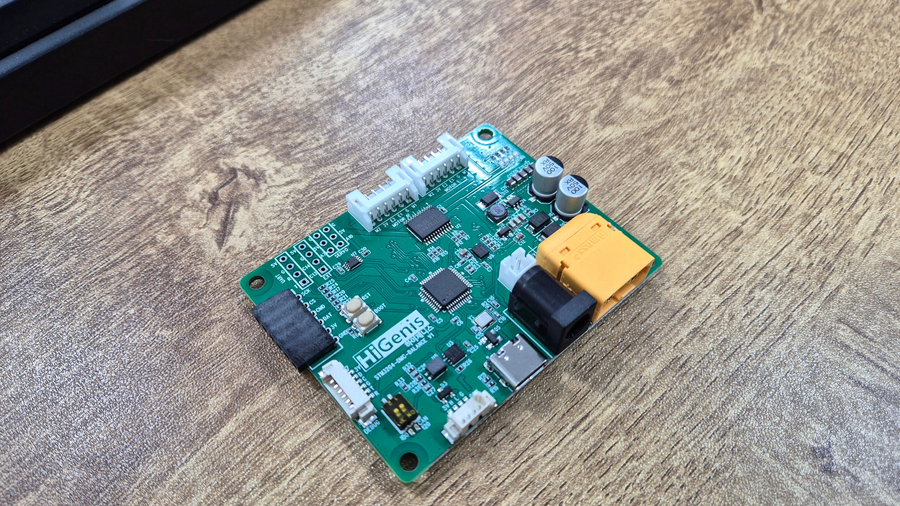

# stm32g4-dmc-balance

유튜브 데모 영상
https://youtu.be/_k8pS9jsCuA?si=o9TG_Lw_guJqtjbA

- MCU: STM32G431CB
- DC Motor: TB6612FNG
- 6축센서: ICM-42670-P
- FD-CAN 트렌시버 내장
- 입력 전압: 10~18V (모터 전원 겸용으로 사용)
- 기타:
    - 5V PWM: 서보 모터 및 네오 픽셀용
    - PS2 컨트롤러용 확장 핀(2.54mm 6핀)
    - UART 통신용 확장 핀(2.54mm 4핀)
    - USB-C 타입